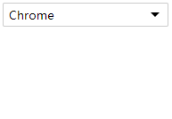

# `SimulationUI` 自定义下拉列表之三事件绑定
在上篇中编写了组件的结构并渲染插入到文档中。上篇回顾 [自定义组件编写-下拉列表之二结构渲染](https://github.com/loshafee/simulationUI/blob/master/doc/自定义组件编写-下拉列表之二结构渲染.md)，接下来将绑定组件的事件。

## `bindEvent` 事件绑定
- 回顾联想 `select` 下拉列表的表现及状态。点击下拉选项出现，事件处理函数如下：
      
      bindEvent: function () {
        var self = this
        // 创建事件
        var event = new CustomEvent("change", {"detail":{"select":true}})
        var ul = self.el.querySelector('ul')
        // 点击前先隐藏ul列表
        ul.style.display = 'none'
        // 给整个列表添加点击事件
        this.el.addEventListener('click', function (e) {
            var tagName = e.target.tagName
            if (tagName === "INPUT") {
                // 目标元素input
                // 判断ul列表的显隐
                ul.style.display = (ul.style.display === 'none' ? 'block' : 'none')
            } else if (tagName === 'LI') {
                // 目标元素li
                ul.style.display = 'none'
                if (self._prevItem === e.target) {
                    // 阻止重复点击
                    return
                }
                self._prevItem = e.target
                this.children[0].value = e.target.textContent
                self.value = e.target.dataset.id
                // 分发事件
                self.el.dispatchEvent(event)
            }
            // 阻止事件冒泡
            e.stopPropagation()
        }, false)
        ul.children[0].click() // 事件模拟
        document.addEventListener('click', function () {
            ul.style.display = 'none'
        }, false)
      }

    整个事件处理函数中，使用了事件委托，子元素的事件都会冒泡到共同的父元素中，通过事件目标 `e.target` 的元素名称获取目标对象。以此将 `li` 元素的文本内容 `textContent` 赋值到 `input` 中。并且初始模拟触发第一个 `li` 被点击 `ul.children[0].click()`。如此则下拉列表拥有自定义数据的第一个值。

- 原生 `select` 原生拥有 `change` 事件，能够通过 `select.addEventListener('change', function (){}, false)` 检查下拉列表值变化的过程。幸运的是，我们能够通过 `CustomEvent` 来添加自定义事件。
    简单用法创建自定义事件

      var event = new CustomEvent("change", {"detail":{"select":true}})

    `change` 是我们自定义的事件类型，第二个参数为可选参数，其中包括用户需要传递的自定义数据。
    更多参考 [CustomEvent](https://developer.mozilla.org/zh-CN/docs/Web/API/CustomEvent)
    
    以上只是定义了事件，我们还需要在满足某些特定条件的时间触发以上时间，那么适合触发该事件的时机在哪？
    回顾上面的 `bindEvent` 处理函数以及联系原生`select`的`change`事件，因此需要在点击`li`元素的时候触发。那么如果触发该事件呢？也很简单，使用

        element.dispatchEvent(event) 

    其中`element` 为需要绑定的父元素，`event`即是通过`CustomEvent`创建的自定义事件。

- 最后，回到组件中来，其中组件的调用方式为

      // 调用方式
      var simSelect = new SimulationSelect({
          el: '#app',
          data: [{id: 1, key:'Chrome'}, {id: 2, key:'IE'}, {id: 3, key:'Firefox'}, {id: 4, key:'Opera'}]
      })
  那么，添加监听事件的方法即为常规方法。

      simSelect.el.addEventListener('change', function (e) {
          // e为事件对象，此处可返回对应的e的属性及自定义的数据e.detail
      })
  
  此处需要将事件绑定到`simSelect.el`元素上，而非`simSelect`，其实原因是`addEventListener`事件必须绑定到html元素上，而`SimulationSelect`创建的实例返回的为非DOM元素，此处也可将`SimulationSelect`改造成返回`simSelect.el`，则可以直接将事件绑定到`simSelect`实例上。

  到这一步，似乎已经完成了，其实，还差最后一步了，就是获取自定义`SimulationSelect`的选中值。

  

- 这里，也简单回顾一下`select`获取值的方式
    
      // 获取select的值，如果`option`不存在value，则返回其内容
      select.value 
      // 获取选中值的下标
      select.selectedIndex
      // 获取select下的option
      select.options
      // 获取被选中option的下标值
      select.options.selectedIndex

  对照原生元素`select`，确定我们下一步需要补充的内容。
  于是，在构造函数中

      var SimulationSelect = function (config) {
        /** 省略其他 **/
        this.options = []
        this.value = ''
        this.options.selectedIndex = 0
        this.selectedIndex = 0
    }

  `this.options`可在渲染函数`render`中获取并赋值

      this.options = this.el.querySelectorAll('li')
   
   下拉列表的值其实就是结构中选中的`li`属性`dataset`中`id`的值，所以，这里关键的一点是，如何获取被选中的`li`所在兄弟元素中的下标。常规方法可以遍历所有的`li`跟当前点击的`li`比较，是否为同一节点，是则返回该`index`。此处，我们根据DOM树关系使用另一种方法。新建一个函数，
      
      /**
      * 获取元素的下标
      * @param {Element} element - 需要查找下标的元素
      * @returns {Number} index - 返回的下标
      **/
      getIndex: function (element) {
        var index = 0
        // 判断目标元素的是否存在前一个兄弟元素，有则将当前元素赋值为前一个兄弟元素
        while (element.previousElementSibling) {
            index++
            element = element.previousElementSibling
        }
        return index
      }

    接着在`bindEvent`绑定事件函数中，添加对应逻辑代码

      bindEvent: function () {
        /** 省略其他代码 **/
        var self = this
        this.el.addEventListener('click', function (e) {
            if (tagName === "INPUT") {
            } else if (tagName === 'LI') {
                this.children[0].value = e.target.textContent // 设置input的value值

                self.selectedIndex = self.options.selectedIndex = self.getIndex(e.target)
                self.value = e.target.dataset.id
            }
        }, false)
      }
    
    最后，即可通过 `simSelect.value` 获取下拉列表的值，通过`simSelect.selectedIndex`获取选中item的下标值。
    
## 结语
整个自定义组件的大概流程于此，重新总结一下
 - 选定重写的自定义组件
 - 定义结构
 - 编写样式
 - 编写JS组件
    - 构造函数定义
    - 原型方法添加，一般都会包含
        - init - 初始化函数
        - template 模板函数
        - render 渲染函数
        - bindEvent 事件绑定函数
        - destroy 销毁函数（该组件没写...）
    - 方法函数注释
- 使用文档编写（如注释按照某种规范，可使用工具直接生成）
- 案例Demo展示
- 优化扩展，自定义多选下拉列表

