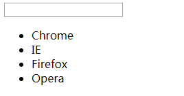
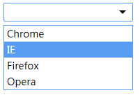

# `SimulationUI` 自定义下拉列表之二结构渲染
在上一篇中介绍了 `simulationSelect` 自定义下拉列表的概设，整个组件的设计[自定义下拉列表之概设](./自定义组件编写-下拉列表之一概设.md)，接下来该篇将详细讲解并编写具体功能逻辑代码。

## `SimulationSelect`组件主要代码回顾

    ;(function (win, undef) {
        // IIFE 匿名立即函数
        var SimulationSelect = function (config) {
            this.config = Object.assign({
                data: []
            }, config)
            this.el = document.querySelector(this.config.el)
            this.options = []
            this.options.selectIndex = 0
            this.value = ''
            this.init() // 新增，初始化函数调用
        }
        SimulationSelect.prototype = {
            constructor: SimulationSelect,
            init: function () {
                this.render()
                this.bindEvent()
            },
            render: function () {},
            bindEvent: function () {},
            destroy: function () {}
        }
        win.SimulationSelect = SimulationSelect
    }(window, void 0))

    // 调用方式
    var simSelect = new SimulationSelect({
        el: 'selector'
    })

## `init` 初始化函数
首先，`init` 初始化函数中包含两个功能，DOM节点`render`渲染以及`bindEvent`事件绑定，该方法的调用可以方便地放在构造函数中。

### `render` DOM节点渲染函数
- 编写`render`方法的功能主要是构建DOM节点并插入文档中，此处有

      render: function () {
          // 创建div元素节点
          var container = document.createElement('div')
          // 设置内容，其中内容之后通过template函数返回
          container.innerHTML = `<input type="text" readonly="readonly">
                                <ul>
                                    <li data-id="0">Chrome</li>
                                    <li data-id="1">IE</li>
                                    <li data-id="2">Firefox</li>
                                    <li data-id="3">Opera</li>
                                </ul>`
          // 将生成的内容添加进el中
          while (container.firstElementChild) {
              this.el.appendChild(container.firstElementChild)
          }
          // 获取该元素下所有的li元素
          this.options = this.el.querySelectorAll('li')
          // 删除container
          delete container
      }

    通过`new SimulationSelect({el: 'body'})`调用有，

    

    可以按照个人的意愿修改该自定义样式。

- 组件结构内容可以通过传入数据生成，这里新增一个`template`方法

      template: function () {
            var itemData = this.config.data
            return `<input type="text" readonly="readonly">
                <ul>
                    ${itemData.map(function (item) {
                        if (typeof item === 'object' && item !== null) {
                            return `<li data-id="${item.id}">${item.key}</li>`
                        }
                        return `<li data-id="${item}">${item}</li>`
                    }).join('')}
                </ul>`
      }

    上面使用了ES6中的字符串模板，十分方便拼接生成字符串。并且此处可以处理两种类型的 `data` 格式
    - 一种是 `['A', 'B', 'C', 'D']`
    - 另一种 `[{id: 1, key:'Chrome'}, {id: 2, key:'IE'}, {id: 3, key:'Firefox'}, {id: 4, key:'Opera'}]`

    对应的 `render` 函数中修改 `innerHTML` 行代码：

      render：function () {
          container.innerHTML = this.template()
      }

    则有以下代码

      ;(function (win, undef) {
        // IIFE 匿名立即函数
        var SimulationSelect = function (config) {
            this.config = Object.assign({
                data: []
            }, config)
            this.el = document.querySelector(this.config.el)
            this.options = []
            this.options.selectIndex = 0
            this.value = ''
            this.init() // 新增，初始化函数调用
        }
        SimulationSelect.prototype = {
            constructor: SimulationSelect,
            init: function () {
                this.render()
                this.bindEvent()
            },
            template: function () {
                var itemData = this.config.data
                return `<input type="text" readonly="readonly">
                    <ul>
                        ${itemData.map(function (item) {
                            if (typeof item === 'object' && item !== null) {
                                return `<li data-id="${item.id}">${item.key}</li>`
                            }
                            return `<li data-id="${item}">${item}</li>`
                        }).join('')}
                    </ul>`
            },
            render: function () {
                // 创建div元素节点
                var container = document.createElement('div')
                // 设置内容，其中内容之后通过template函数返回
                container.innerHTML = this.template()
                // 将生成的内容添加进el中
                while (container.firstElementChild) {
                    this.el.appendChild(container.firstElementChild)
                }
                // 获取该元素下所有的li元素
                this.options = this.el.querySelectorAll('li')
                // 删除container
                delete container
            },
            bindEvent: function () {},
            destroy: function () {},
        }
        win.SimulationSelect = SimulationSelect
      }(window, void 0));

      // 调用方式
      var simSelect = new SimulationSelect({
            el: 'body',
            data: [{
                id: 1,
                key: 'Chrome'
            }, {
                id: 2,
                key: 'IE'
            }, {
                id: 3,
                key: 'Firefox'
            }, {
                id: 4,
                key: 'Opera'
            }]
      })

    添加个人自定义样式，并使用class `simulation-select` 标记。

        ul,ol {
            list-style: none;
            padding: 0;
            margin: 0;
        }
        .simulation-select {
            margin: 0 auto;
            display: inline-block;
            font-family: "Microsoft Yahei";
            position: relative;
            user-select: none;
        }
        .simulation-select::after {
            content: "";
            position: absolute;
            right: 10px;
            top: 11px;
            border: 5px solid ;
            border-color: currentColor transparent transparent transparent;
            width: 0;
            height: 0;
        }
        .simulation-select input {
            display: block;
            box-sizing: border-box;
            width: 100%;
            outline: none;
            font-family: "Microsoft Yahei";
            padding: 4px 26px 4px 6px;
            border: 1px solid #ccc;
            border-radius: 2px;
            -webkit-user-select: none;
        }
        .simulation-select input:focus {
            border-color: #599df2;
        }
        .simulation-select ul {
            position: absolute;
            background-color: #fff;
            left: 0;
            top: 28px;
            font-size: 14px;
            box-sizing: border-box;
            width: 100%;
            margin-top: 4px;
            border: 1px solid #599df2;
        }
        .simulation-select ul li {
            padding: 2px 4px;
        }
        .simulation-select ul li:hover {
            background-color: #599df2;
            color: #fff;
        }
    
    最后得到如图：
    
    

    下篇将讲解如何给组件绑定事件-[自定义下拉列表之三事件绑定](./自定义组件编写-下拉列表之三事件绑定.md)

    
