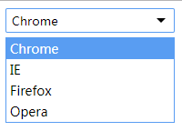

# `SimulationUI`自定义下拉列表之一概设
由于修改 `select` 元素自带的默认样式以及 `option` 选择的默认样式并不能满足某些特定的人员的特定需求，同时也怀着重造轮子的精神，一起来写个能自定义样式的模拟`select`，因此有了这个小项目，有了想法就开始实施了。
- 立项，为自己要做的东西起个名字也算挺重要的，说不定将来就被广大开发者所应用了呢。所以就起了`SimulationUI`，难说以后不模拟编写其他`UI`元素，而`UI`下的模拟下拉列表自然就叫`SimulationSelect`。
- 编写组件模式，主要是在浏览器端。可以使用以下模式。后期可考虑加上模块化处理。

        ;(function (win, undef) {
            // IIFE 匿名立即函数
            var SimulationSelect = function () {}
            // ... 相关逻辑代码
            SimulationSelect.prototype = {
                constructor: SimulationSelect
            }
            win.SimulationSelect = SimulationSelect
        }(window, void 0))
    相信如果编写过jQuery插件的同学对以上结构十分熟悉，以上为IIFE匿名立即执行函数，并传入`window`，`void 0`参数，函数内部定义了我们需要的组件`SimulationSelect`，并将其设置为全局对象。还有最开头所添加的分号`;`。虽然此处只有短短几行的代码，却包含了不少`javascript`的知识点，如`IIFE`、`ASI`机制，函数作用域等，相当部分的开发者也对此不十分清楚理解。这里就不细讲了。
- 确立定义该类`SimulationSelect`的调用方式，如通过传入配置项`config`对象，其中`el`属性为页面中需要模拟下拉列表的元素选择器

      var simSelect = new SimulationSelect({
        el: 'selector'
      })

- 该类`SimulationSelect` 实例 `simSelect `包含的属性`property`，当然这个设定也不一定就是这个，都会根据后期的功能需求来定，或增加，或删除。
    - `config` {Object} - 配置项
    - `el` {Element} - 容器元素
    - `options` {Array} - 子项元素列表
        - `selectedIndex` {Number} - 当前所选子项下标
    - `value` {String} - 该模拟下拉列表的返回值

此时，则有`SimulationSelect`类的内容

    var SimulationSelect = function (config) {
        // 此处相当于深拷贝
        this.config = Object.assign({
            data: []
        }, config)
        this.el = document.querySelector(this.config.el)
        this.options = []
        this.options.selectedIndex = 0
        this.value = ''
    } 
- 定义该类`SimulationSelect` 实例 `simSelect `包含的方法`method`
    - `init()` - 初始化函数，组件模拟入口，可在实例化时调用，内部可调用`render`，`bindEvent`等函数
    - `render()` - 渲染函数，将模板转换成DOM结构，并插入到实例的`el`元素中
    - `bindEvent()` - 事件处理函数，绑定元素组件的事件，此处会涉及到自定义事件[`CustomEvent`](https://developer.mozilla.org/zh-CN/docs/Web/API/CustomEvent)，同学们可以先了解该概念。
    - `destroy()` - 销毁函数，`optional`，如需要可销毁组件

则有，以下代码

    SimulationSelect.prototype = {
        constructor: SimulationSelect,
        init: function () {
            this.render()
            this.bindEvent()
        },
        render: function () {},
        bindEvent: function () {},
        destroy: function () {}
    }

- 接着，定义需要的`DOM`结构

      

          <input type="text" readonly="readonly">
          <ul>
            <li data-id="0">Chrome</li>
            <li data-id="1">IE</li>
            <li data-id="2">Firefox</li>
            <li data-id="3">Opera</li>
          </ul>
      

- 样式css

        ul,ol {
            list-style: none;
            padding: 0;
            margin: 0;
        }
        .simulation-select {
            margin: 0 auto;
            display: inline-block;
            font-family: "Microsoft Yahei";
            position: relative;
            user-select: none;
        }
        .simulation-select::after {
            content: "";
            position: absolute;
            right: 10px;
            top: 11px;
            border: 5px solid ;
            border-color: currentColor transparent transparent transparent;
            width: 0;
            height: 0;
        }
        .simulation-select input {
            display: block;
            box-sizing: border-box;
            width: 100%;
            outline: none;
            font-family: "Microsoft Yahei";
            padding: 4px 26px 4px 6px;
            border: 1px solid #ccc;
            border-radius: 2px;
            -webkit-user-select: none;
        }
        .simulation-select input:focus {
            border-color: #599df2;
        }
        .simulation-select ul {
            display: none;
            position: absolute;
            background-color: #fff;
            left: 0;
            top: 28px;
            font-size: 14px;
            box-sizing: border-box;
            width: 100%;
            margin-top: 4px;
            border: 1px solid #599df2;
        }
        .simulation-select ul li {
            padding: 2px 4px;
        }
        .simulation-select ul li:hover {
            background-color: #599df2;
            color: #fff;
        }
可查看自定义的下拉列表样式

## 总结
以上即为组件重写的基本架构，功能的完善可在此基础上添砖加瓦。此处希望给大家抛砖引玉，下一篇继续完善该组件，更多的是功能性的编写。
